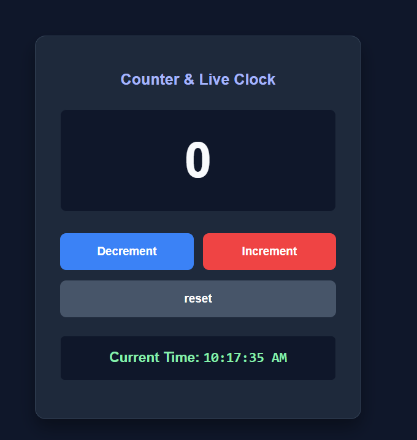

# ⏱ Counter & Live Clock — React Project

A simple and beautiful **ReactJS counter application** with a **real-time live clock** using `useState()` and `useEffect()`.  
This project is perfect for beginners to understand **React State, Events, and Lifecycle Hooks**.

---

## 🚀 Features
- ✔ Increment & Decrement Counter
- ✔ Reset Button
- ✔ Real-Time Digital Clock (`setInterval`)
- ✔ Styled with Modern UI
- ✔ Clean Component Design

---

## 🧠 Concepts Covered
| Concept | Description |
|--------|------------|
| `useState()` | Manages counter & time state |
| `useEffect()` | Updates time every second |
| Event Handling | Button Click Events |
| CSS Styling | Custom modern UI |

---

## 📸 UI Preview





---

## 📦 Installation & Setup

### 1️⃣ Clone the Repository
```bash
git clone https://github.com/your-username/repo-name.git

```
## 🧩 Folder Structure
```bash

src/
│── Counter.jsx       # Counter component with live time
│── Counter.css       # Styling for UI
│── App.jsx           # Component render
│── main.jsx          # React DOM setup
```

## 🧠 Core Logic Example

```javascript
const [count, setCount] = useState(0);
const [time, setTime] = useState(new Date());

useEffect(() => {
  const timer = setInterval(() => setTime(new Date()), 1000);
  return () => clearInterval(timer);
}, []);

```

## ✨ Made with ❤️ by Tosif Kuresh


