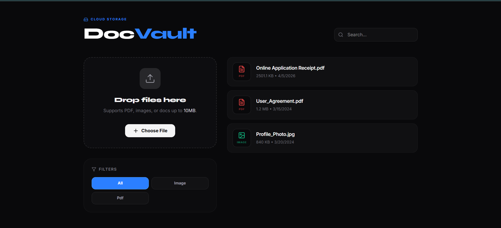

# DocVault

Modern file upload dashboard built with React, Vite, Tailwind CSS, Redux Toolkit, and Firebase configuration scaffolding.


## Overview

DocVault is a sleek storage dashboard UI for uploading, previewing, filtering, searching, downloading, and deleting files in a clean single-page experience.

It is designed as a frontend-first Firebase storage project:

- drag and drop or choose files manually
- simulated upload progress for a polished UX
- instant local preview for uploaded images
- quick filtering by file type
- search across uploaded filenames
- Redux Toolkit + Firebase Realtime Database slice already included for scaling the app beyond local UI state

## Preview



## Features

- Beautiful dashboard-style interface with toast feedback
- Drag-and-drop upload zone
- Support for images, PDFs, and common document types
- Search bar for fast file discovery
- File-type filters for `all`, `image`, and `pdf`
- Download action for uploaded file data
- Delete action with instant UI updates
- Firebase app and Realtime Database setup file included

## Current Behavior

The current UI stores uploaded file content in browser memory as Base64 and uses local component state for the visible file list.

This means:

- the upload flow looks real and feels complete
- uploaded files do not persist after refresh through the current UI
- the Redux slice in `src/features/fileSlice.js` is prepared for Firebase-backed persistence, but it is not wired into the dashboard components yet

If you want, this project is in a great place to evolve next into true Firebase Storage + Realtime Database persistence.

## Tech Stack

- React 19
- Vite 7
- Tailwind CSS 4
- Redux Toolkit
- React Redux
- Firebase 12
- Lucide React icons

## Getting Started

### 1. Clone and install

```bash
npm install
```

### 2. Create your environment file

Create a `.env` file in the project root:

```env
VITE_API_KEY=your_api_key
VITE_AUTH_DOMAIN=your_project.firebaseapp.com
VITE_DATABASE_URL=https://your-project-id-default-rtdb.firebaseio.com
VITE_PROJECT_ID=your_project_id
VITE_MESSAGING_SENDER_ID=your_sender_id
VITE_APP_ID=your_app_id
```

### 3. Start the development server

```bash
npm run dev
```

### 4. Build for production

```bash
npm run build
```

### 5. Preview the production build

```bash
npm run preview
```

## Firebase Setup

This project already includes Firebase initialization in `src/firebase/firebaseConfig.js`.

To connect it to your own Firebase project:

1. Create a Firebase project.
2. Enable Realtime Database.
3. Copy your Firebase web app credentials.
4. Add them to the `.env` file using the `VITE_` variables above.

## Project Structure

```text
src/
|- app/
|  |- store.js
|- component/
|  |- FileList.jsx
|  |- UploadFile.jsx
|- features/
|  |- fileSlice.js
|- firebase/
|  |- firebaseConfig.js
|- pages/
|  |- Dashboard.jsx
|- App.jsx
|- main.jsx
```

## Scripts

```bash
npm run dev      # start local dev server
npm run build    # create production build
npm run preview  # preview built app
npm run lint     # run ESLint
```

## How It Works

### Upload flow

- user selects or drops a file
- file is converted to Base64 in the browser
- a simulated progress bar gives visual feedback
- uploaded item is added to the dashboard list

### File list flow

- files can be searched by name
- filters narrow the list by type
- images render a real preview card
- downloads use the stored Base64 payload

### State flow

- the dashboard currently uses local React state for rendered items
- Redux store is configured globally
- async Firebase actions already exist in the slice for future integration

## Possible Next Improvements

- connect dashboard actions to Redux async thunks
- move file binaries to Firebase Storage instead of Base64
- persist file metadata in Realtime Database or Firestore
- add authentication and per-user file isolation
- support upload validation and size limits in logic, not just UI text
- add pagination, sorting, and file detail views

## Why This Project Stands Out

This is more than a basic upload form. It already has the feel of a product UI:

- intentional visual design
- smooth interaction states
- clean component separation
- backend-ready structure for future Firebase integration

## Author Notes

This repo is a strong foundation for learning:

- file handling in React
- dashboard UI design
- Redux Toolkit async workflows
- preparing a frontend for Firebase integration

---

If you want to turn this into a fully working cloud file manager next, the best next step is wiring `Dashboard.jsx` to the Redux Firebase slice and storing actual files in Firebase Storage.
