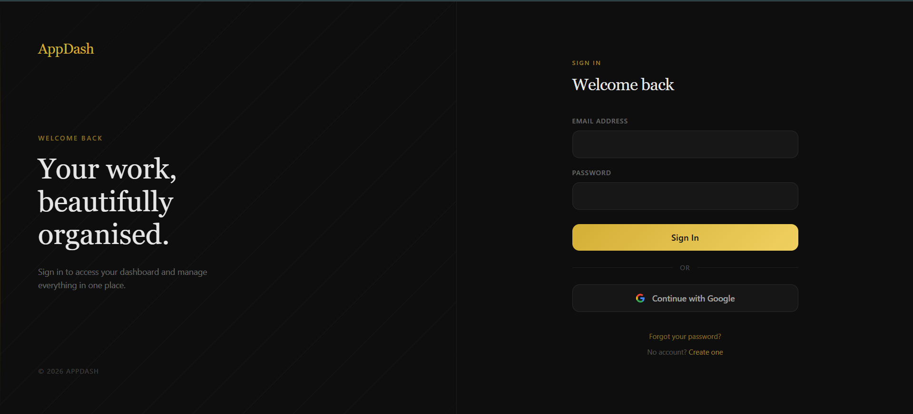
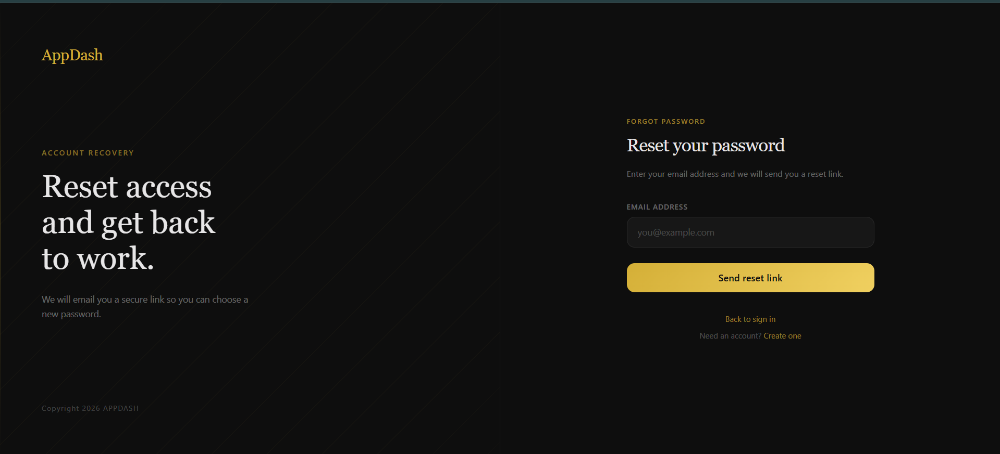
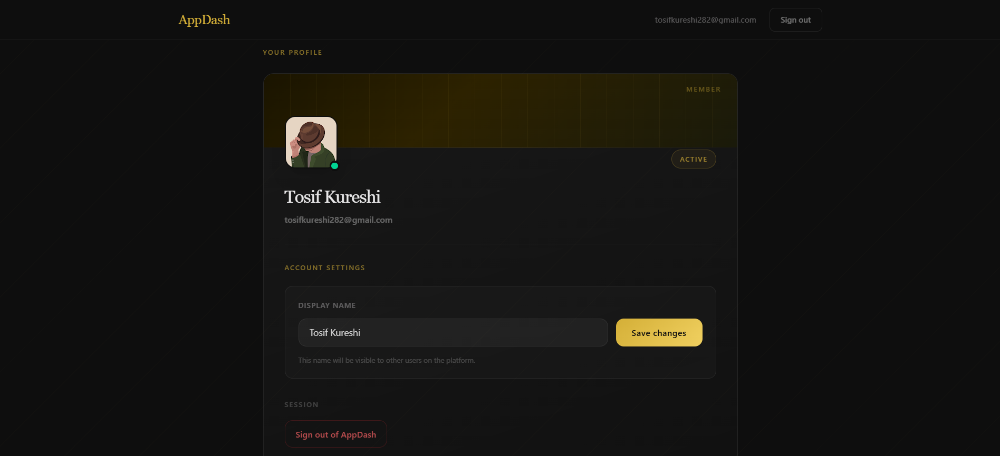

# 🔐 Firebase Authentication App

A modern and fully functional **Authentication System** built using React, Vite, Tailwind CSS, and Firebase Authentication.

This project demonstrates a complete auth flow including **signup, login, Google authentication, protected routes, profile management, and password recovery**, all wrapped in a clean and responsive UI.

---

## 📸 Screenshots

### 🔑 Login Page



### 🔁 Forgot Password



### 👤 Dashboard / Profile



---

## ✨ Features

* 🔐 Email & Password Signup
* 🔓 Secure Login System
* 🌐 Google Sign-In (OAuth)
* 🛡️ Protected Routes with authentication guard
* 🔄 Persistent auth state using `onAuthStateChanged`
* 👤 Update user display name
* 📩 Password reset via email
* 🔑 Change password (for logged-in users)
* 📱 Fully responsive dark UI (Tailwind CSS)

---

## 🛠️ Tech Stack

* ⚛️ React 19
* ⚡ Vite 7
* 🔥 Firebase Authentication
* 🔗 React Router DOM 7
* 🎨 Tailwind CSS 4

---

## 📂 Project Structure

```id="9j3mrf"
src/
├── assets/
│   ├── Forget-Password.png
│   ├── LoginPage.png
│   └── Profile.png
├── component/
│   ├── Dashboard.jsx
│   ├── ForgotPassword.jsx
│   ├── Login.jsx
│   ├── ProtectedRoute.jsx
│   └── Signup.jsx
├── contexts/
│   └── AuthContext.jsx
├── Firebase.jsx
├── App.jsx
├── main.jsx
└── index.css
```

---

## 🚀 Getting Started

### 📌 Prerequisites

* Node.js (v18+ recommended)
* npm
* Firebase account

---

### 📦 1. Clone Repository

```id="bq5jdb"
git clone https://github.com/your-username/your-repo-name.git
cd your-repo-name
```

---

### 📥 2. Install Dependencies

```id="r9s2k4"
npm install
```

---

### 🔥 3. Firebase Setup

1. Go to Firebase Console

2. Create a new project

3. Navigate to: **Authentication → Sign-in method**

4. Enable:

   * Email/Password
   * Google

5. Go to **Project Settings → General**

6. Add a Web App

7. Copy Firebase config

---

### 🔐 4. Environment Variables

Create `.env` file in root:

```id="b9j6lw"
VITE_FIREBASE_API_KEY=your_api_key
VITE_FIREBASE_AUTH_DOMAIN=your_auth_domain
VITE_FIREBASE_PROJECT_ID=your_project_id
VITE_FIREBASE_STORAGE_BUCKET=your_storage_bucket
VITE_FIREBASE_MESSAGING_SENDER_ID=your_messaging_sender_id
VITE_FIREBASE_APP_ID=your_app_id
```

> ℹ️ Note: `databaseURL` is optional if you're not using Realtime Database.

---

### ▶️ 5. Run the App

```id="9r2kqe"
npm run dev
```

Open in browser:

```id="3rgzra"
http://localhost:5173
```

---

## 🔄 Authentication Flow

1. User signs up, logs in, or continues with Google
2. Firebase verifies credentials
3. `onAuthStateChanged` keeps session in sync
4. Protected routes restrict unauthorized access
5. User can manage profile & password securely

---

## 🔑 Password Management

### 📩 Forgot Password

* User clicks **Forgot Password**
* Receives reset email from Firebase
* Sets new password securely

---

### 🔁 Change Password

* Available for email/password users
* Requires recent authentication
* Google users cannot change password inside app

---

## 📦 Available Scripts

```id="b4m6mf"
npm run dev      # Start development server
npm run build    # Production build
npm run preview  # Preview build
npm run lint     # Run ESLint
```

---

## 🧠 Learning Highlights

This project showcases:

* Firebase Authentication integration
* Secure route protection
* Context API for global auth state
* Environment-based configuration
* Clean UI with Tailwind CSS
* Real-world authentication flows

---

## ⚠️ Notes

* Firebase Authentication must be enabled
* Google login requires provider setup
* For password updates, re-login may be required (security rule)

---

## 🙌 Author

Made with ❤️ by **Tosif**

---

