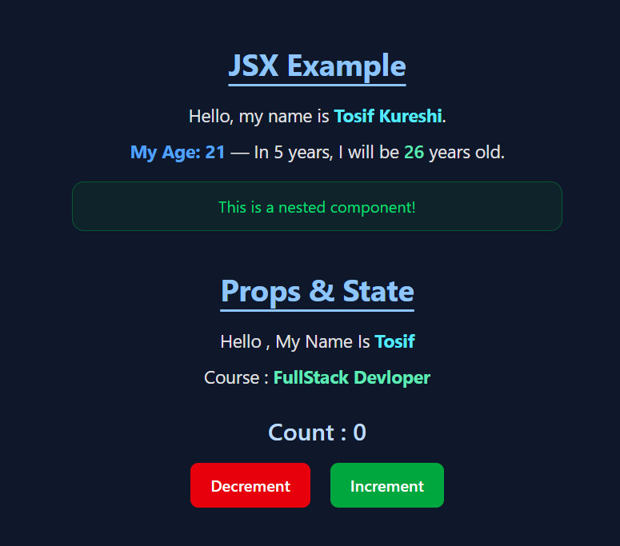
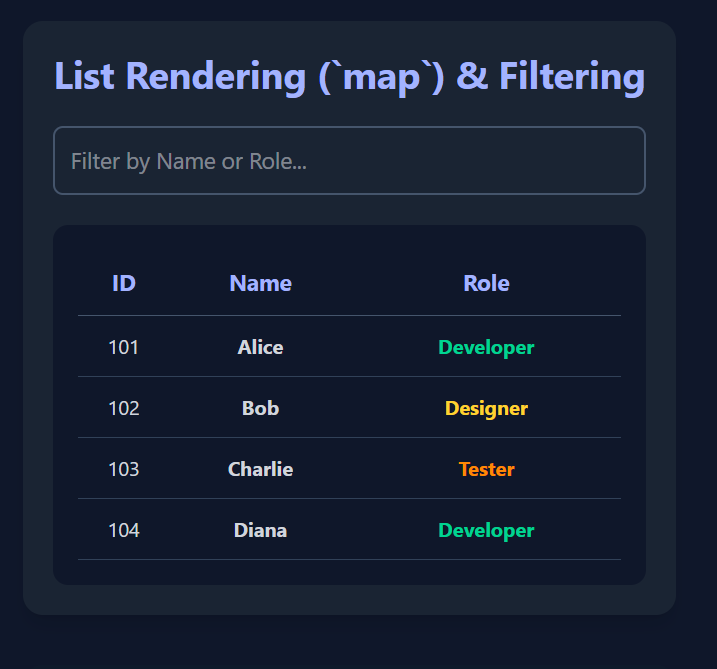
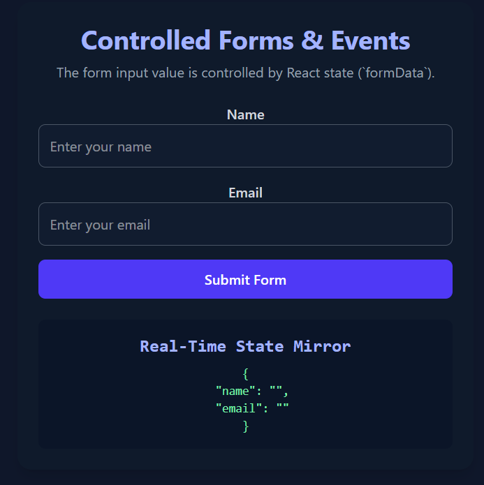
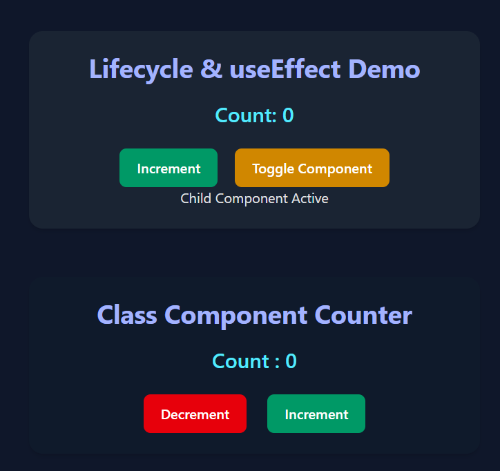

# 🚀 React Explorer — Complete React Concepts Demo

This project contains practical mini-examples of **core React concepts** implemented in separate components with beautiful Tailwind UI styling.  
Perfect for beginners and intermediate developers learning **React fundamentals**.

---

## 🧠 Concepts Covered

| Topic | Description | File |
|--------|------------|-------|
| JSX Example & Nested Components | JSX syntax + component inside component | `JSXDemo.jsx` |
| Props & State Handling | Passing props and updating UI with state change | `PropsStateDemo.jsx` |
| List Rendering & Filtering | `.map()` + `.filter()` + Search input | `ListRender.jsx` |
| useEffect Lifecycle Hooks | Mount / Update / Unmount + setInterval | `LifecycleDemo.jsx` |
| Class Component Counter | State update using `setState()` in class | `ClassComponent.jsx` |

---

## 🎮 UI Features
- ✔ Modern Tailwind UI
- ✔ Button theme for increment, decrement, toggle
- ✔ Real-time dynamic list search filter
- ✔ Lifecycle events logs in console
- ✔ Reusable structured components

---

## 🧠 Core Logic Explanation

### 1️⃣ JSX & Nested Components
```jsx
function Message() {
  return <p>This is a nested component!</p>;
}
```
- JSX allows combining HTML-like syntax inside JS and reusable component structure.

### 2️⃣ Props & State
```jsx
const [count, setCount] = useState(0);
<button onClick={() => setCount(count + 1)}>Increment</button>
```
- useState() stores UI state values and triggers re-render automatically.

### 3️⃣ List Rendering + Filter Logic
```jsx
employees.filter((emp) =>
  emp.name.toLowerCase().includes(search.toLowerCase())
);
```
- Renders only matching results dynamically when typing in search box.

### 4️⃣ useEffect Lifecycle Example
```jsx
useEffect(() => {
  console.log("Component Mounted");
  return () => console.log("Component Unmounted");
}, []);

```
- Demonstrates mount and cleanup behavior with timer side-effect.

### 5️⃣ Class Component Counter
```jsx
this.state = { count: 0 };
this.setState({ count: this.state.count + 1 });

```
- setState() updates UI in class-based components.

## 📁 Folder Structure

```
src/
│── components/
│    ├── JSXDemo.jsx
│    ├── PropsStateDemo.jsx
│    ├── ListRender.jsx
│    ├── LifecycleDemo.jsx
│    ├── ClassComponent.jsx
│
│── App.jsx
│── index.css
│── main.jsx
│── assets/
│     └── 1.png  # screenshot

```
## 📸 Project Screenshot










##✨ Made with ❤️ by Tosif Kureshi
