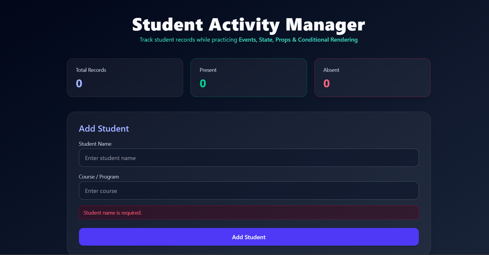
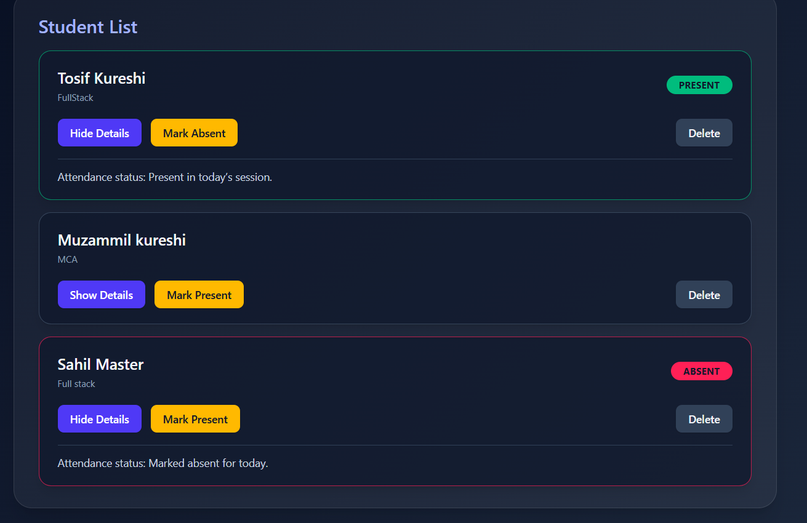

# Student Activity Manager – React Project

A modern dark-theme Student Attendance Dashboard built with React & TailwindCSS.  
This project demonstrates practical React concepts such as Events, State, Props, Conditional Rendering, and List Rendering through a real-time student management interface.

---

## 🚀 Features

- Add Student (Name + Course)
- Mark Present / Mark Absent
- Show / Hide Student Details
- Delete Student
- Real-time Dashboard Stats (Total / Present / Absent)
- Fully responsive dark UI
- State-based UI rendering (no backend)

---

## 🧠 React Concepts Covered

- useState – State Management
- Event handling (onClick, onChange, onSubmit)
- Passing arguments in event handlers
- Conditional rendering
- List rendering with `.map()`
- Component-based architecture

---

## 📂 Project Structure

src/
│
├── App.jsx
│
├── components/
│   ├── StudentForm.jsx
│   ├── StudentList.jsx
│   └── StudentCard.jsx
│
└── index.css / main.jsx

---

## 🏗 Installation & Setup

### 1. Clone repository

### 2. Install dependencies

### 3. Start development server

---

## 🎨 UI Preview Summary

Dashboard (Total / Present / Absent statistics)
Add Student Form
Student List with controls:
[ Show Details ]  [ Mark Present / Mark Absent ]  [ Delete ]

---

## 📸 Project Screenshot

## 🖥 Tech Stack

- React JS
- Tailwind CSS
- JavaScript (ES6+)
- Vite (Frontend Bundler)

---

## ✨ Future Improvements

- LocalStorage save support
- Search / Filtering functionality
- Animated transitions
- Export attendance report

---

## 👨‍💻 Developer

**Tosif Kureshi**  

### 🎉 Thank You & Happy Coding!
