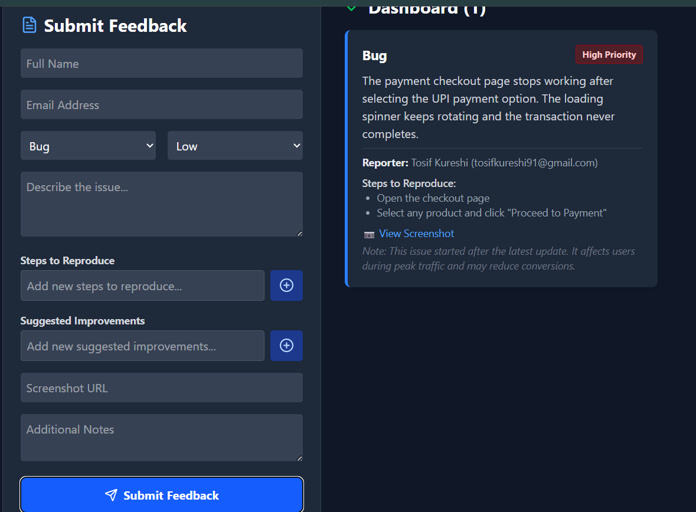
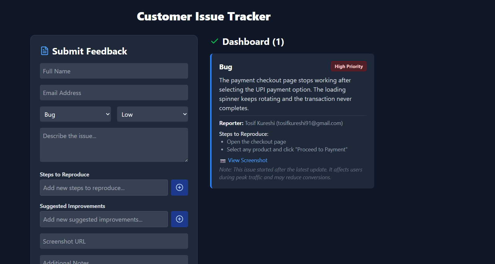

# 🛠️ Customer Feedback & Issue Reporting System

A modern **React-based feedback management system** that allows users to submit bug reports, suggestions, and complaints with dynamic form inputs and real-time dashboard updates.  
This project demonstrates **controlled + uncontrolled components**, **dynamic list handling**, **callback Refs() usage**, and **clean component architecture**.

---

## 🚀 Features

| Feature | Description |
|--------|------------|
| 🎯 Submit Structured Feedback | Name, Email, Category, Priority & Description |
| 📝 Dynamic Inputs | Add & remove steps and suggestions dynamically |
| 🧠 Controlled + Uncontrolled Fields | Industry-standard form example |
| 🪪 Callback Refs() | Used instead of `useRef()` or `createRef()` |
| ⚡ Real-time Dashboard | Feedback instantly appears without page refresh |
| 🎨 Modern UI | TailwindCSS + Lucide icons |
| 🧱 Component Architecture | Separated reusable components (card, list, form) |

---

## 📁 Project Structure

```
src/
├─ components/
│ ├─ FeedbackCard.jsx
│ ├─ FeedbackList.jsx
│ ├─ FeedbackForm.jsx
│ └─ DynamicList.jsx
└─ App.jsx
```


---

## 🛠️ Tech Stack

| Technology | Purpose |
|------------|---------|
| **ReactJS** | UI Development |
| **Tailwind CSS** | Styling & Responsive Layout |
| **Lucide-React** | Icons |
| **Callback Refs()** | Uncontrolled form fields |

---

## 📦 Installation & Setup

### 1️⃣ Clone Repository
```bash
git clone https://github.com/yourusername/customer-feedback-system.git
```
## 2️⃣ Install Dependencies
``` bash
npm install
```
## 3️⃣ Start Project
```bash
npm start
```

## 🎮 How to Use

1. Enter your Name, Email, Description and choose Category & Priority

2. Add Steps to Reproduce or Suggestions dynamically using (+)

3. You can remove any added item using the Trash icon

4. Optional fields: Screenshot URL & Notes (Uncontrolled via Refs())

5. Press Submit Feedback

6. Feedback will immediately appear in the Dashboard section

## 📸 Screenshots

### 🧾 Form Preview


### 📋 Dashboard Preview



🧠 Concepts Demonstrated

## 🔹 Controlled Components

- Used for Name, Email, Description & Dropdown fields

## 🔹 Uncontrolled Components (Refs)

```jsx
let screenshotRef = null;
<input ref={(el) => (screenshotRef = el)} />
```

## 🔹 Dynamic List System

```jsx
items.map((item, index) => (...))

```
## 👨‍💻 Developer

### Tosif Kureshi
- Passionate Frontend Developer | ReactJS & Full-Stack Learner 🚀