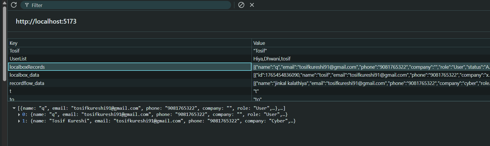
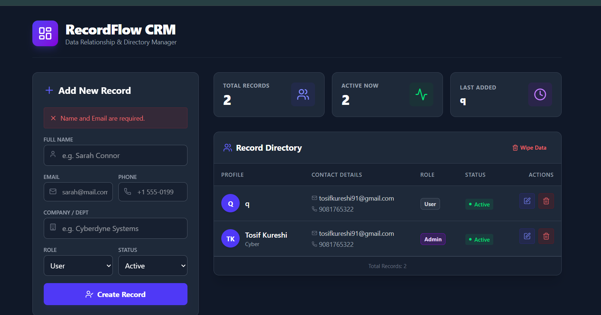

# 🚀 RecordFlow CRM — ReactJS LocalStorage CRUD System 

A modern ReactJS CRM Dashboard for managing client records with full CRUD operations and LocalStorage-based data persistence.
RecordFlow CRM provides a clean, responsive interface for adding, editing, deleting, and reviewing client information with instant real-time updates.

---

## 🚀 Features

- 👤 Add Client (Name, Email, Phone, Company, Role, Status)

- ✏️ Edit Records with form auto-fill

- 🗑️ Delete Single Record or Clear All Data

- 📊 Live Dashboard (Total Records, Active Users, Last Added)

- 🧠 LocalStorage Sync – Data refresh pe bhi save hota hai

- 🎨 Beautiful CRM UI using TailwindCSS

- ⚛️ Modular reusable components

- 📱 Fully Responsive Layout

---

## 📁 Project Structure

```
src/
│── components/
│   ├── RecordForm.jsx
│   ├── RecordList.jsx
│   ├── RecordRow.jsx
│   └── DashboardStatus.jsx
│
├── App.jsx
├── main.jsx
└── index.css

```


---

## 🛠️ Tech Stack

| Technology | Usage |
|------------|---------|
| **ReactJS** | UI Development |
| **Tailwind CSS** | Styling & Responsive Layout |
| **Lucide-React** | Icons |
| **LocalStorage-API** | Offline Storage |
| **React Hooks()** | State & Effects |

---

## 📦 Installation & Setup

### 1️⃣ Clone Repository
```bash
git clone https://github.com/your-username/recordflow-crm.git
```
## 2️⃣ Install Dependencies
``` bash
npm install
```
## 3️⃣ Start Project
```bash
npm start
```

## 🎮 How to Use

1. Fill the form and create a client record

2. New records appear instantly in the list

3. Click Edit to modify any record

4. Click Delete to remove a single record

5. Use Wipe Data to clear all records

6. Dashboard updates automatically based on data changes

## 📸 Screenshots

### 🧾 Form & Dashboard Preview


### 📋 LocalStorage Preview


### 📋 Error Preview



🧠 Concepts Demonstrated

## 🔹 Controlled Components

- Used for all form fields with controlled states.

## 🔹 LocalStorage Synchronization

```jsx
useEffect(() => {
  localStorage.setItem("localboxRecords", JSON.stringify(records));
}, [records]);

```

## 🔹 CRUD Operations

- Add, edit, delete, and clear functionalities.

## 🔹 Component Interaction

- Parent-to-child props & child-to-parent callbacks.
## 👨‍💻 Developer

### Tosif Kureshi
- Passionate Frontend Developer | ReactJS & Full-Stack Learner 🚀
