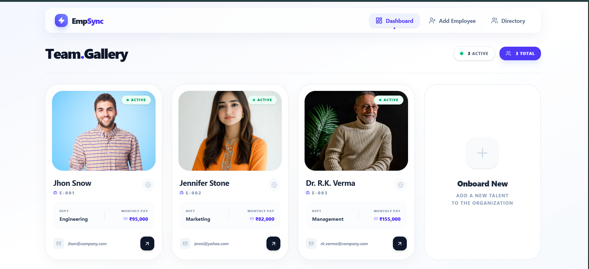
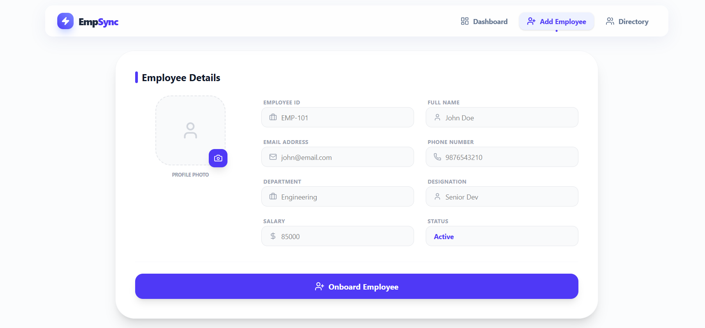
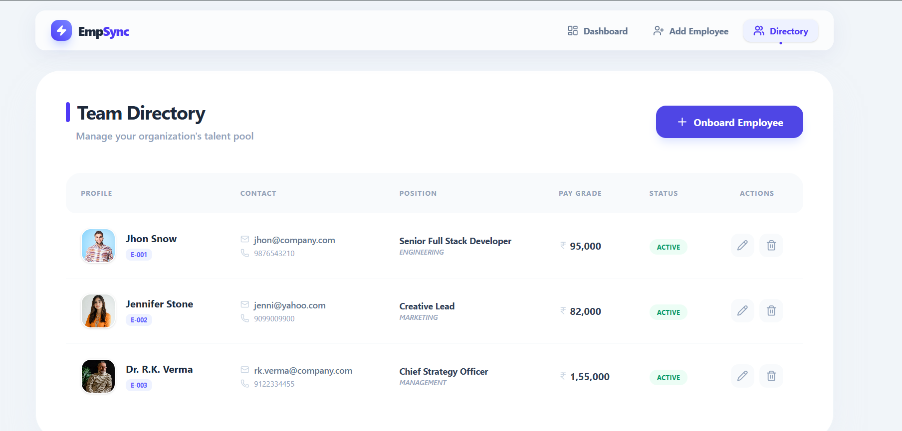
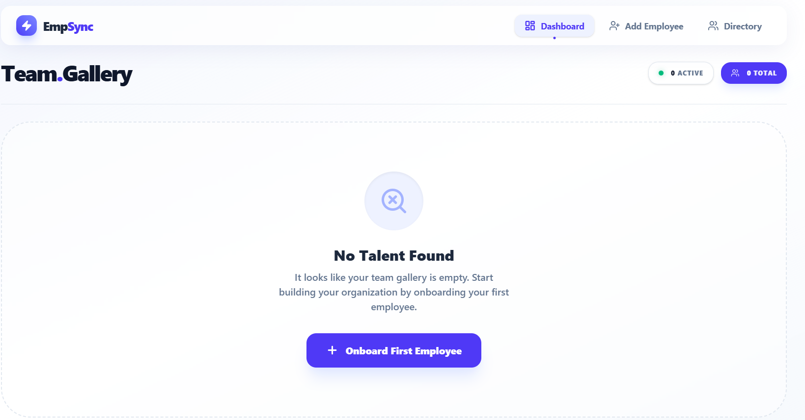
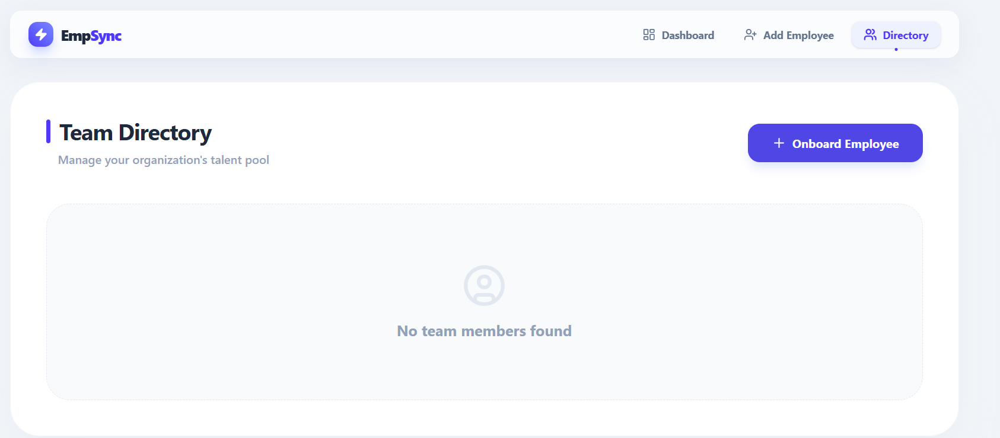

# 🧑‍💼 Employee Management System (CRUD Router App)

A modern **React CRUD application** for managing employees using **React Router** and **LocalStorage**.
This project demonstrates real‑world frontend concepts like routing, form handling, state management, and persistent storage without a backend.

---

## 🚀 Features

| Feature             | Description                                   |
| ------------------- | --------------------------------------------- |
| ➕ Add Employee      | Add employee details with image upload        |
| 📄 View Employees   | Display all employees in a table              |
| ✏️ Edit Employee    | Update employee details using dynamic routing |
| 🗑️ Delete Employee | Remove employee with instant UI update        |
| 💾 LocalStorage     | Data persists even after page refresh         |
| 🧭 React Router     | Smooth navigation between pages               |
| 🖼️ Image Upload    | Store and display employee images             |
| 📱 Responsive UI    | Clean and simple user interface               |

---

## 🛠️ Tech Stack

* **React (Vite)**
* **React Router DOM**
* **JavaScript (ES6+)**
* **HTML5 & CSS3**
* **LocalStorage API**

---

## 📂 Project Structure

```
CRUD-Router-app/
│── src/
│   ├── components/
│   │   └── Navbar.jsx
│   ├── pages/
│   │   ├── Home.jsx
│   │   ├── addEmployee.jsx
│   │   ├── viewEmployee.jsx
│   │   └── updateEmployee.jsx
│   ├── assets/
│   ├── App.jsx
│   ├── main.jsx
│   └── index.css
│── package.json
│── vite.config.js
│── index.html
```

---

## ⚙️ Installation & Setup

1. **Clone the repository**

```bash
git clone <repo-url>
```

2. **Navigate to project folder**

```bash
cd CRUD-Router-app
```

3. **Install dependencies**

```bash
npm install
```

4. **Run the project**

```bash
npm run dev
```

5. Open in browser:

```
http://localhost:5173
```

---

## 🧠 How It Works

* Employee data is stored in **browser LocalStorage**
* CRUD operations update both **state & LocalStorage**
* `useParams()` is used for dynamic edit routing
* `useEffect()` loads stored data on component mount

---

## 📸 Screenshots
### 🧾 Dashboard Preview


### 📋 Add Employee Preview


### 📋 Manage Employee Preview


### 📋 No data On Dashboard Preview


### 📋 No data On Manage Page Preview


---

## 🎯 Learning Outcomes

* Hands‑on experience with **React Router**
* Practical **CRUD implementation**
* Working with **LocalStorage**
* Component‑based architecture
* Clean folder structuring

---

## 👨‍💻 Author

**Tosif Kureshi**
Frontend / React Developer

---

## ⭐ Support

If you like this project, don’t forget to ⭐ star the repository!

---

### 💡 Future Enhancements

* Search & filter employees
* Pagination
* Confirmation modals
* Backend integration (Node / Firebase)

---

Happy Coding 🚀
