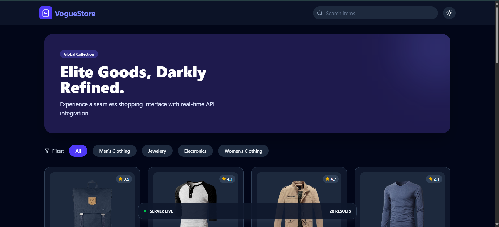
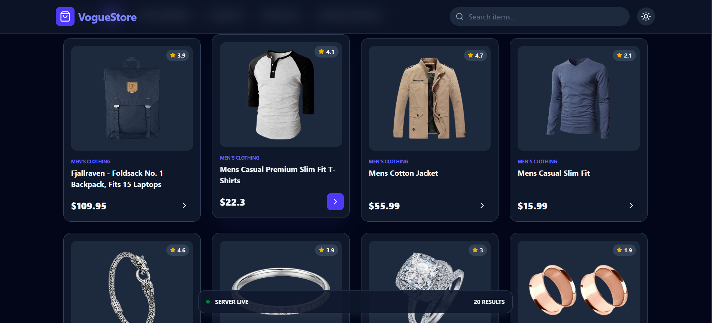
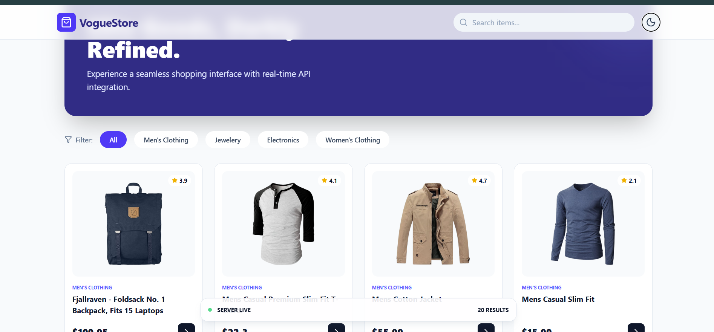
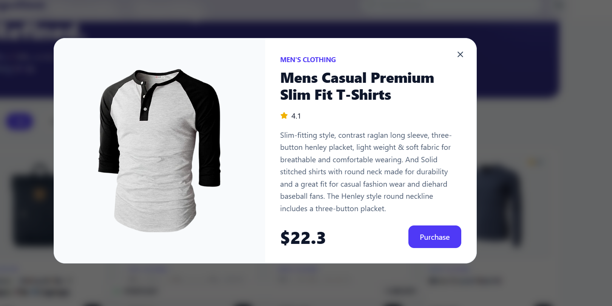

# 🛍️ VogueStore — API Hunter Project

A modern **React + Tailwind CSS e‑commerce UI** that fetches products from a live API and provides search, filtering, dark mode, and product detail preview.

Built as part of the **API Hunter assignment** to demonstrate API integration, state management, and responsive UI skills.

---

# 🚀 Live Features

✅ Fetch products from FakeStore API
✅ Real‑time search
✅ Category filtering
✅ Product detail modal
✅ Dark / Light theme toggle
✅ Responsive grid layout
✅ Loading skeletons
✅ Error handling

---

# 🧠 Tech Stack

* React (Hooks)
* Tailwind CSS
* Lucide Icons
* FakeStore API
* Vite

---

# 📦 API Used

**FakeStore API**
[https://fakestoreapi.com/products](https://fakestoreapi.com/products)

Provides:

* Product title
* Image
* Price
* Category
* Rating
* Description

---

# 📁 Project Structure

```
src/
  App.jsx
  pages/
    Home.jsx
  hooks/
    useProducts.js
  components/
    Navbar.jsx
    Hero.jsx
    CategoryBar.jsx
    ProductCard.jsx
    ProductGrid.jsx
    ProductModal.jsx
    StatusBar.jsx
```

---

# ⚙️ Installation & Setup

```bash
# clone repo
git clone <your-repo-link>

# install deps
npm install

# run dev server
npm run dev
```

App runs at:

```
http://localhost:5173
```

---

# 🔍 How It Works

### 1️⃣ API Fetching

`useProducts` hook fetches product data and manages:

* loading state
* error state
* products array

---

### 2️⃣ Search & Filter

Products filtered using:

```js
const filteredProducts = products.filter(item =>
  item.title.toLowerCase().includes(searchTerm.toLowerCase()) &&
  (selectedCategory === "All" || item.category === selectedCategory)
);
```

---

### 3️⃣ Product Modal

Clicking a product card opens a detailed modal view with:

* image
* rating
* description
* price

---

### 4️⃣ Dark Mode

Dark theme controlled via state and Tailwind `dark` class.

---

# 📱 Responsive Design

Grid adapts automatically:

* Mobile → 1 column
* Tablet → 2 columns
* Desktop → 4 columns

---

# 🎯 API Hunter Requirements — Covered

| Requirement      | Status |
| ---------------- | ------ |
| API fetch        | ✅      |
| Loading state    | ✅      |
| Error handling   | ✅      |
| Search           | ✅      |
| Filter           | ✅      |
| Responsive UI    | ✅      |
| Clean components | ✅      |
| UX polish        | ✅      |

---

# 📸 Screenshots

### Home Page


### Product Grid



### Theme Chnage (Dark/Light)



### Product Description




Product Modal
# ✨ Author

**Tosif Kureshi**
Frontend Developer (React / UI)

---

# 📜 License

This project is for educational/demo purposes.

---

# ⭐ Acknowledgement

FakeStore API for demo product data.
