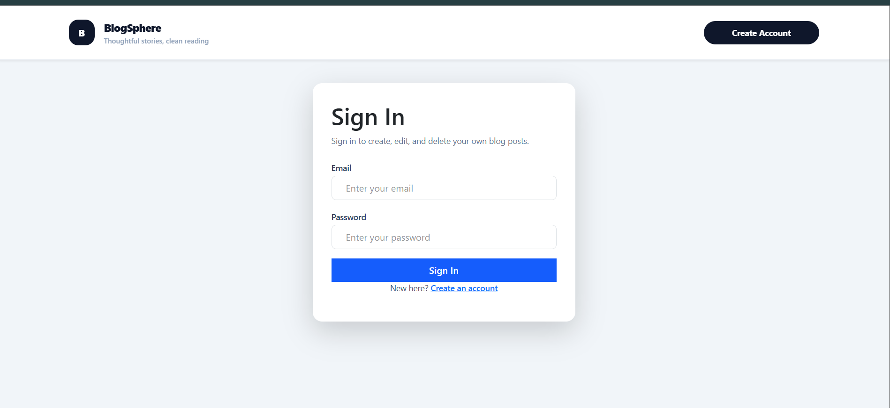
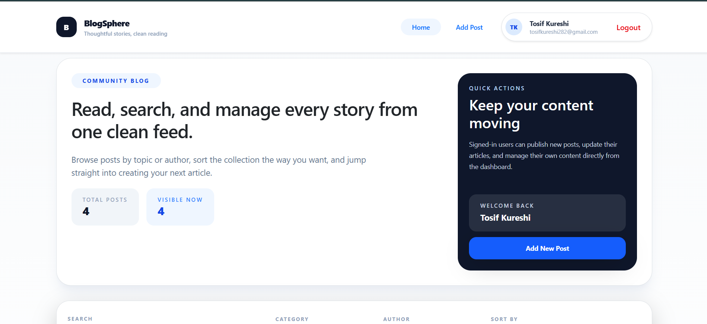
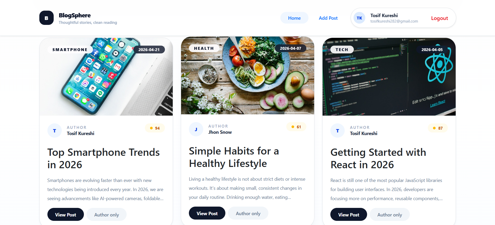
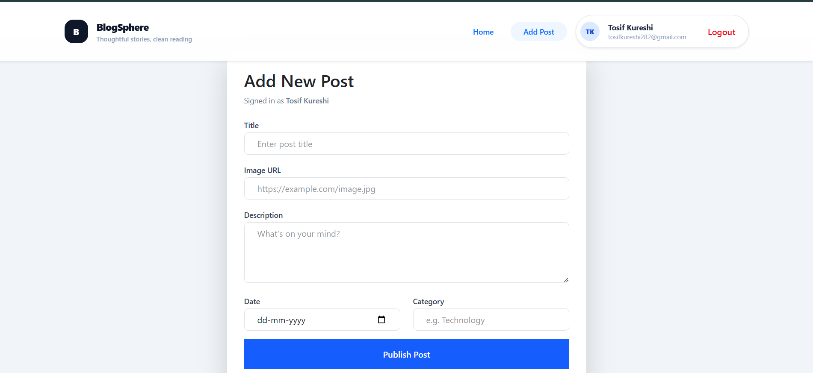
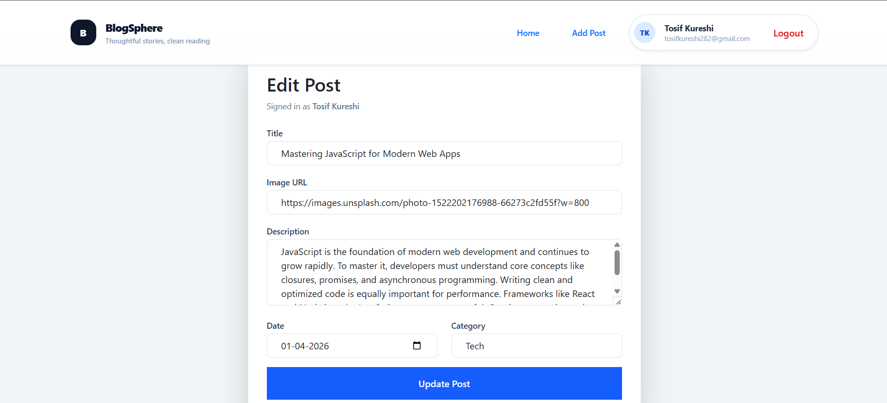
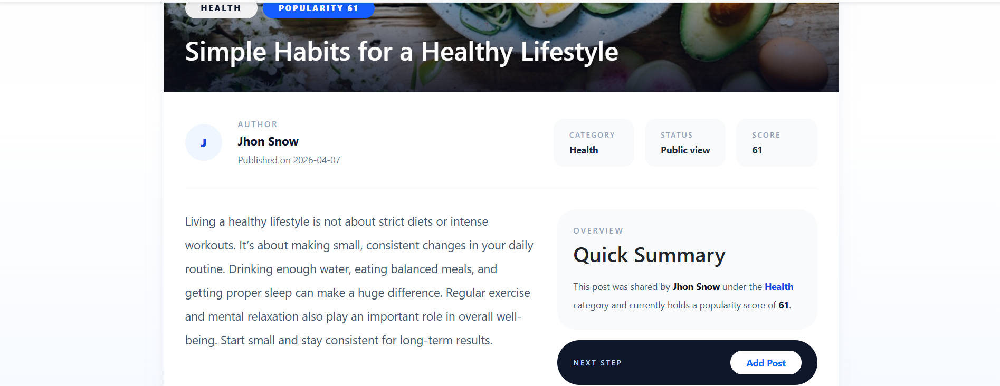

# 🚀 BlogSphere - Modern Blog App

A modern and fully functional **Blog Application** built using **React (Vite), Redux Toolkit, React Router, Tailwind CSS, and JSON Server**.

This project demonstrates a complete real-world blog system including **authentication, protected routes, CRUD operations, and advanced filtering/sorting**, all wrapped in a clean and responsive UI.

---

## ✨ Features

### 🔐 Authentication

* User Signup & Login system
* Protected routes using PrivateRoute
* Only authenticated users can access blog features

### 📝 Blog Management

* Create new blog posts
* Edit and delete your own posts
* View detailed post pages
* Author-based post control

### 🔍 Search, Filter & Sort

* Search posts by:

  * Title
  * Description
  * Category
  * Author
* Filter by category and author
* Sort posts by:

  * Date
  * Popularity
  * Title

### 🎨 UI/UX

* Clean and modern UI using Tailwind CSS
* Fully responsive design
* Proper visual hierarchy
* Minimal and user-friendly navigation

---

## 🛠️ Tech Stack

* ⚛️ React (Vite)
* 🧠 Redux Toolkit
* 🔁 React Router DOM
* 🎨 Tailwind CSS
* 🗄️ JSON Server (Mock Backend)

---

## 📁 Project Structure

```
Blog-App/
├── public/
├── src/
│   ├── components/        # UI Components (Navbar, PostCard, etc.)
│   ├── context/           # Auth Context
│   ├── features/
│   │   ├── auth/          # Authentication logic
│   │   └── posts/         # Redux slices (posts)
│   ├── App.jsx
│   ├── main.jsx
│   └── index.css
├── db.json                # Mock database
├── package.json
└── README.md
```

---

## 📸 Screenshots

### 🔐 Login Page


### 📝 Blog Dashboard - All Posts View


### 🔃 Sorting Feature - Organized Posts View


### 📂 Filtered Blog List - Enhanced View


### ➕ Add Post


### ✏️ Update Existing Post - Edit Page


### 📄 Post Details


## 🔐 Authentication Flow

* Users must log in before accessing the blog
* Protected routes:

  * `/`
  * `/posts/:id`
  * `/add`
  * `/edit/:id`
* Unauthorized users are redirected to the login page
* New users can register via the signup page

---

## 👤 Post Permissions

* Users can create posts after login
* Users can edit only their own posts
* Users can delete only their own posts
* Each post stores:

  * `userId`
  * `authorName`

---

## 📦 API (JSON Server)

Local backend powered by JSON Server.

### Run server:

```bash
npx json-server --watch db.json --port 5000
```

### API Endpoint:

```
http://localhost:5000/posts
```

---

## ⚙️ Getting Started

### 1️⃣ Install dependencies

```bash
npm install
```

### 2️⃣ Start JSON Server

```bash
npx json-server --watch db.json --port 5000
```

### 3️⃣ Start React App

```bash
npm run dev
```

App runs on:

```
http://localhost:5173
```

---

## 💡 Demo Notes

* Create a new account using signup
* Login to access blog features
* Only logged-in users can manage posts
* Sample data is already available in `db.json`

---

## 🚀 Future Improvements

* 🔐 Real authentication (JWT / Firebase)
* 👤 User profile page
* 💬 Comments system
* ❤️ Like system
* 📝 Rich text editor
* 📷 Image upload support

---

## 👨‍💻 Author

**Tosif Kureshi**

This project was built as a **React practical exam project**, showcasing real-world features like authentication, protected routing, and state management using Redux.

---
