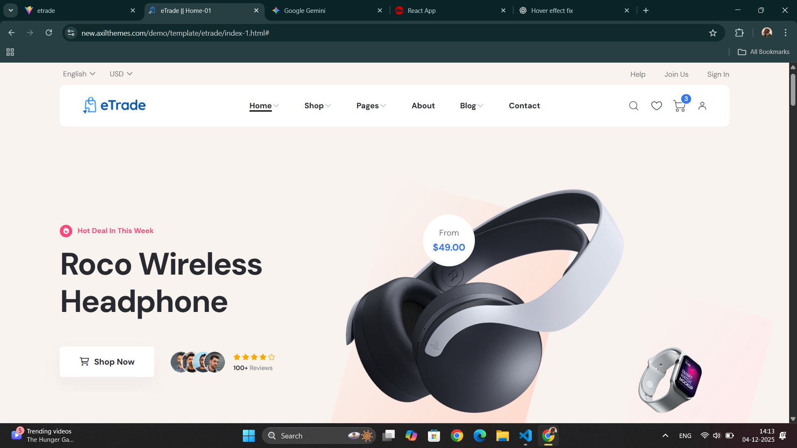
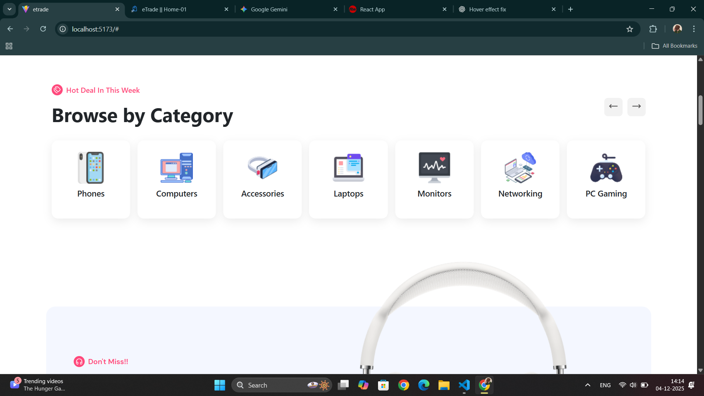
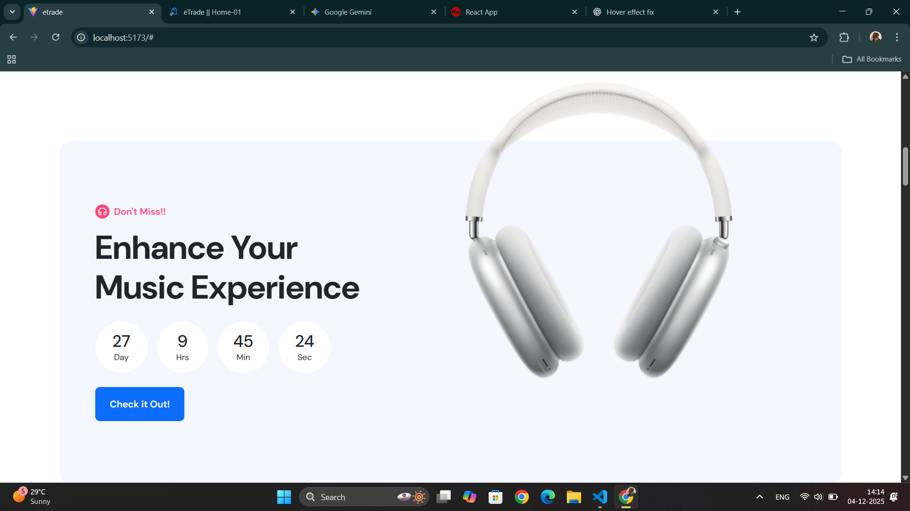
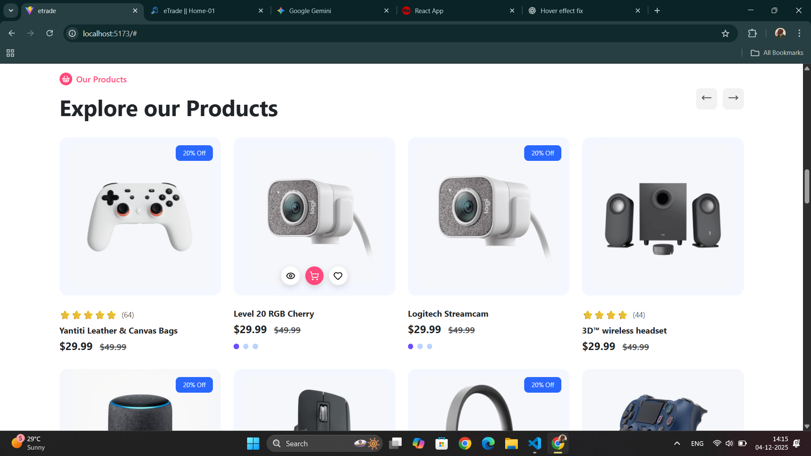
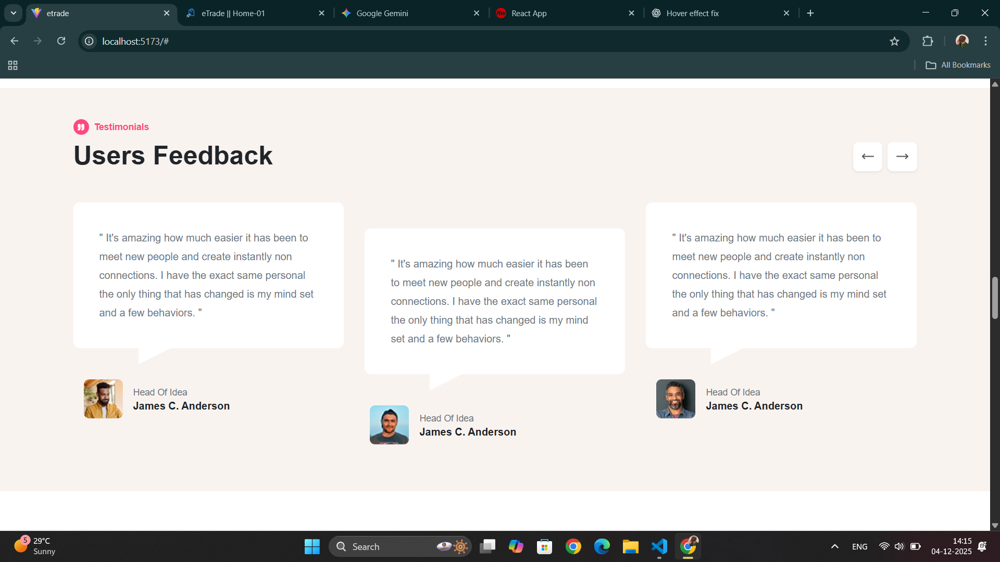
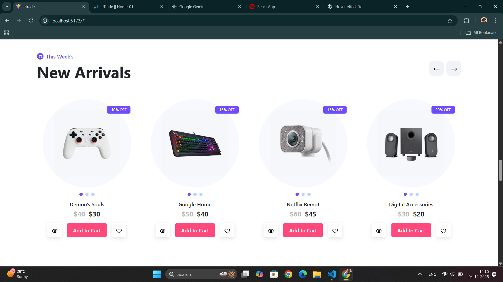
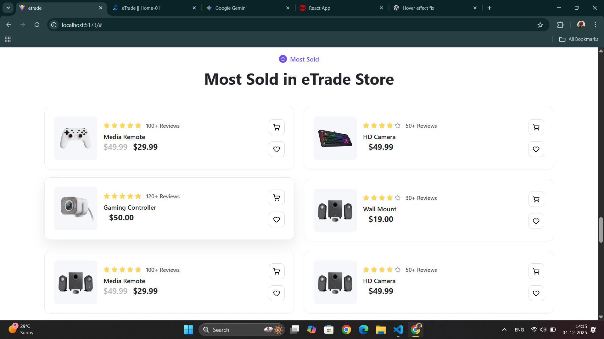
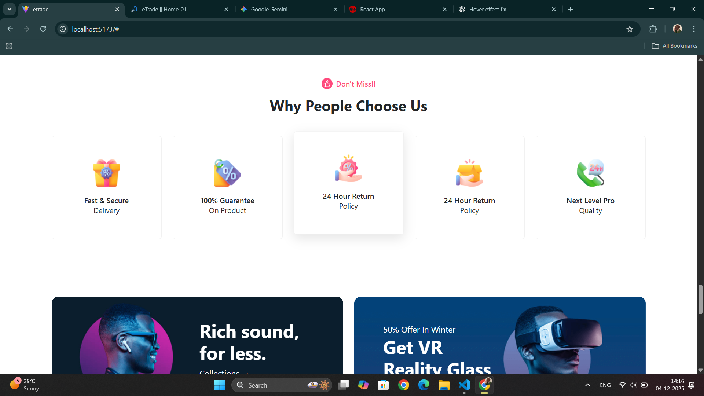
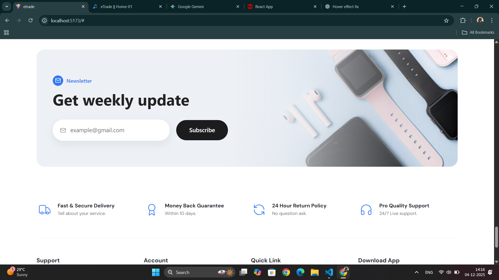
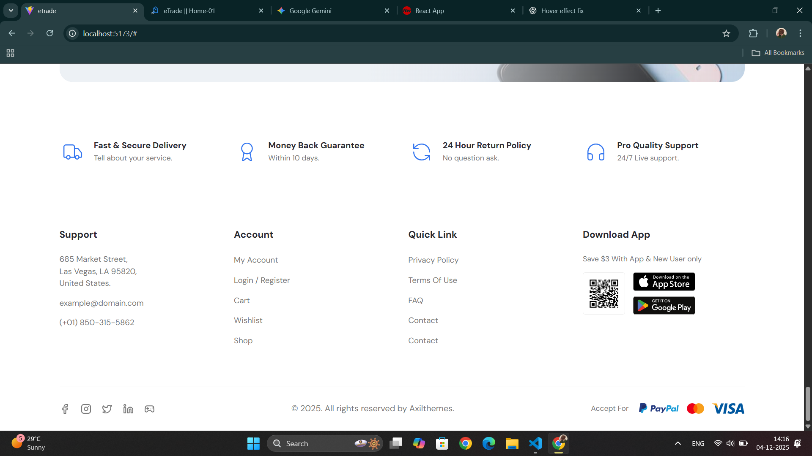

# 🛒 Modern React E-Commerce UI

A clean and modern **E-Commerce Frontend Website** built using **React JS**, **Bootstrap 5**, and **Lucide Icons**, featuring beautiful UI components, product sliders, countdown timer, testimonials, responsive design and more.

---

## 🚀 Live Demo
👉 Coming Soon / Add your deployed link (Vercel / Netlify)

---

## ✨ Features

- 🔥 **Modern Hero Banner** with product carousel and background shapes
- ⏳ **Live Countdown Timer** (for limited deals & offers)
- 🛍 **Reusable Product Cards & Grid Layout**
- 🌟 **Customer Testimonials & Ratings**
- 🧾 **Responsive Navbar with Hover Animation**
- 🛒 **Animated Cart Badge & Icons with Circular Hover Highlight**
- 📱 **Fully Responsive for all Devices**
- 💳 **Payment & Social Icons Integrated**
- 📦 **Services Bar (Delivery, Support, Return, Guarantee)**
- 📥 **Footer with Quick Links & App Download Section**

---

## 🖥 Tech Stack

| Technology | Description |
|-----------|------------|
| React JS | Component-based UI development |
| Bootstrap 5 | Responsive Layout & Utilities |
| Lucide React | Icon library |
| CSS / SCSS | Custom styling & animations |
| JavaScript | Logic & state handling |
| Vercel / Netlify | Deployment (optional) |

---

## 📂 Project Structure
```
/src
├── assets/ # Images & icons
├── components/
│ ├── Navbar/
│ ├── Banner/
│ ├── Countdown/
│ ├── Services/
│ ├── Footer/
│ └── Products/
├── App.js
└── index.js
```

---

## ⚙️ Installation & Setup

Clone the project:
```sh
git clone https://github.com/yourusername/ecommerce-ui.git

1.Install dependencies:

- npm install

2.Start development server:

- npm start

3.Build for production:

- npm run build

```
## 📸 Screenshots





















## 🧑‍💻 Author

- Tosif Kureshi
- Frontend Developer | React Developer 
